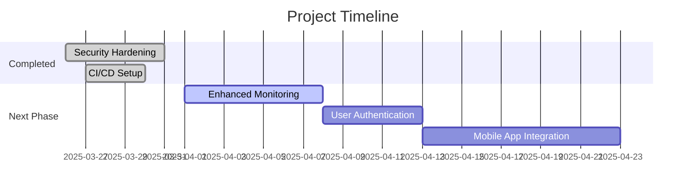

# Telegram Download Bot

A secure Telegram bot for managing downloads via Aria2 RPC, with companion user bot service.

## Features
- Torrent/Magnet link handling
- Download progress tracking
- Secure environment configuration
- Dockerized deployment
- CI/CD pipeline (GitHub Actions)

## Implementation Plan



## Getting Started

### Prerequisites
- Docker & Docker Compose
- Telegram API credentials
- Aria2 RPC server

### Docker Deployment

#### Using Pre-built Image (Recommended):
```bash
mkdir telegram-bot && cd telegram-bot
curl -O https://raw.githubusercontent.com/sparshbajaj/telegram-bot/main/docker-compose.yml
curl -O https://raw.githubusercontent.com/sparshbajaj/telegram-bot/main/.env.example

# Rename env file and edit credentials
cp .env.example .env
nano .env

# Start containers
docker-compose up -d
```

#### Build from Source:
```bash
git clone https://github.com/sparshbajaj/telegram-bot.git
cd telegram-bot

# Set up environment
cp .env.example .env
nano .env  # Add your credentials

# Build and run
docker-compose up --build -d
```

## Environment Variables
| Variable            | Required | Description                          |
|---------------------|----------|--------------------------------------|
| BOT_TOKEN           | Yes      | Telegram bot token                   |
| ARIA2_RPC_URL       | Yes      | Aria2 RPC endpoint                   |
| ARIA2_RPC_SECRET    | Yes      | Aria2 RPC secret                     |
| TELEGRAM_API_ID     | Yes      | Telegram API ID                      |
| TELEGRAM_API_HASH   | Yes      | Telegram API Hash                    |

## Monitoring
View logs:
```bash
docker-compose logs -f
```

Check status:
```bash
docker-compose ps
```

## CI/CD Pipeline
Automatically builds and pushes Docker images to:
[Docker Hub](https://hub.docker.com/r/sparshbajaj14/telegram-bot)

Images are tagged with:
- `latest` - Most recent stable build
- Commit SHA - Specific version builds

## Contributing
1. Fork the repository
2. Create feature branch
3. Submit PR with detailed description

> **Security Notice**: Never commit sensitive information in configuration files
