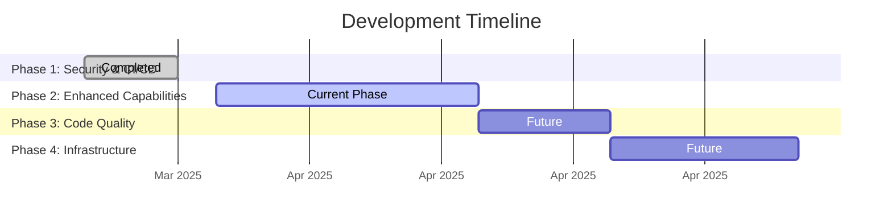

# Project Roadmap

## Phase 1: Security & CI/CD (Completed ✅)
- [x] Environment variable configuration
- [x] Input validation hardening
- [x] GitHub Actions CI/CD pipeline
- [x] Docker Hub integration
- [x] Secret management

## Phase 2: Enhanced Capabilities (Current )
### Monitoring
- [ ] Prometheus/Grafana dashboard integration
- [ ] ELK stack logging setup
- [ ] Docker healthchecks

### Authentication
- [ ] JWT token implementation
- [ ] Telegram login integration
- [ ] Redis rate limiting

### Mobile Integration
- [ ] Flutter prototype app
- [ ] gRPC API gateway
- [ ] SSL pinning configuration

## Phase 3: Code Quality (Planned )
- [ ] Type hint enforcement
- [ ] Unified error handling
- [ ] Logging standardization
- [ ] Comprehensive test suite

## Phase 4: Infrastructure (Planned )
- [ ] Kubernetes cluster setup
- [ ] Prometheus monitoring
- [ ] Automated backups
- [ ] Multi-region deployment

## Key
- ✅ Completed
-  In Progress
-  Planned
